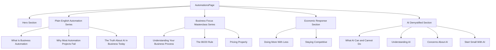

# Plan for Automations Page

## Overview
Create a creative, well-structured **Automations** page that educates users about business automation in a clear, engaging, no-nonsense style. The design will match your website's modern, glassmorphic, animated aesthetic.

---

## 1. Create a new React component
- **File:** `src/AutomationsPage.tsx`
- **Export:** `AutomationsPage`
- **Styling:** Tailwind CSS, consistent with the rest of the site

---

## 2. Add routing
In `App.tsx`, add:
```tsx
<Route path="/automations" element={<AutomationsPage />} />
```
This will render the new page when clicking the Automations menu item.

---

## 3. Page Layout

### Hero Section
- **Headline:**  
  **"Learn What Business Automation Really Means"**
- **Intro paragraph:**  
  "Our education center is designed to give you practical information about business automation without the hype or technical jargon. We believe in empowering you to make informed decisions, whether or not you decide to work with us."
- **Design:**  
  Animated gradient text, subtle background hexagon grid, large and engaging.

---

### Content Sections

#### A. "Plain English" Automation Series
- **What Is Business Automation (Without the BS)**
  - Define automation in practical terms
  - Examples of tasks that should and shouldn't be automated
  - Difference between valuable automation and tech for its own sake
- **Why Most Automation Projects Fail**
  - Complex systems with poor interfaces
  - Solutions designed without understanding the business
  - Unrealistic vendor expectations
  - How to avoid pitfalls
- **The Truth About AI in Business Today**
  - What AI can reliably do
  - What AI struggles with
  - Realistic expectations
  - Simple, valuable applications

---

#### B. Business Focus Masterclass Series
- **Understanding Your Business Process**
  - Map workflows
  - Identify bottlenecks
  - Calculate inefficiency costs
  - Templates for documentation
- **The 80/20 Rule of Business Improvement**
  - Find the 20% of activities with 80% of results
  - Identify high-ROI automation
  - Worksheets and case studies
- **Pricing Your Products and Services Properly**
  - Value-based pricing
  - How automation supports premium pricing
  - Calculate true delivery costs
  - Frameworks for testing prices

---

#### C. Economic Response Section
- **Doing More With Less: Automation in Tough Times**
  - Cost-effective solutions
  - Prioritize immediate ROI
  - Low-risk implementation
  - Turnaround case study
- **Staying Competitive When Margins Are Tight**
  - Preserve margins with automation
  - Improve customer experience without cost
  - Balance efficiency and quality
  - Quick-win timeline

---

#### D. AI Demystified Section
- What AI Really Can and Cannot Do For Your Business Today
- Understanding AI Without the Technical Background
- Legitimate Concerns About AI and How to Address Them
- How to Start Small With AI in Your Business

---

## 4. Styling and Components
- **Glassmorphic cards** with backdrop blur and rounded corners
- **Gradient text** for section titles
- **Lucide icons** for visual cues
- **Collapsible panels** or accordions for subsections
- **Animations** on scroll (fade-in, slide-up)
- **Responsive design** for all devices

---

## Mermaid Diagram



---

## Summary
- **Create** `AutomationsPage.tsx` with a hero and four creative, well-organized sections.
- **Add** a route for `/automations`.
- **Use** Tailwind CSS, gradients, icons, animations, and glassmorphism.
- **Organize** content clearly with collapsible panels or cards.
- **Ensure** responsiveness and clarity.

---